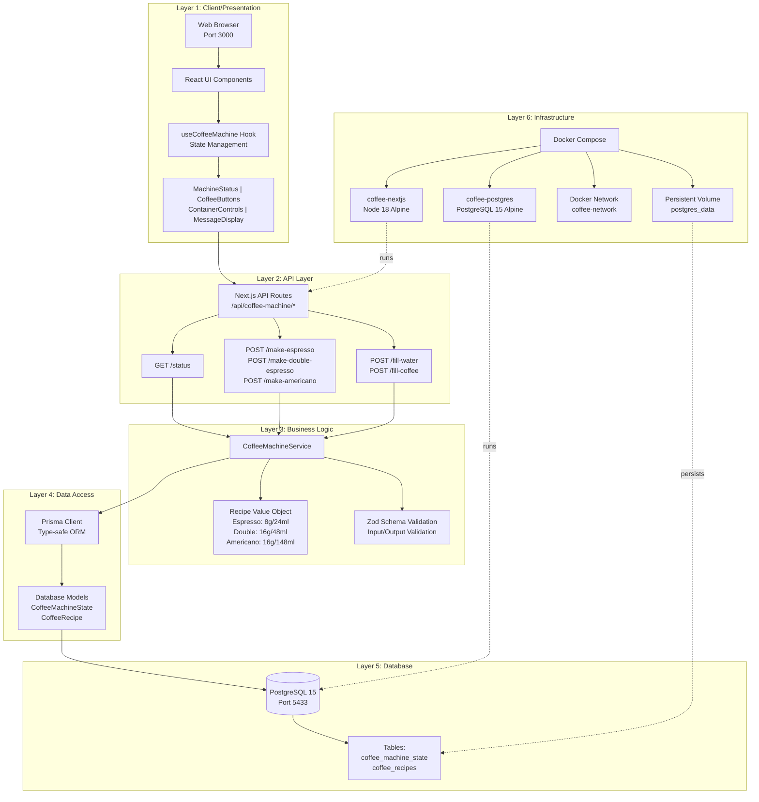

# Coffee Machine Architecture

This document provides a comprehensive overview of the Next.js Coffee Machine application architecture.

## Architecture Layers Flow

## Layer Descriptions

### Layer 1: Client/Presentation
- **Browser**: User interface accessed via web browser on port 3000
- **React UI Components**: Modern React 18 components with TypeScript
- **useCoffeeMachine Hook**: Custom hook managing application state and API calls
- **Components**: 
  - `MachineStatus`: Displays water/coffee levels with progress bars
  - `CoffeeButtons`: Buttons for making different coffee types
  - `ContainerControls`: Inputs for filling water and coffee containers
  - `MessageDisplay`: Shows success/error messages to users

### Layer 2: API Layer
- **Next.js API Routes**: RESTful endpoints under `/api/coffee-machine/`
- **Endpoints**:
  - `GET /status`: Retrieve current machine status
  - `POST /make-espresso`: Make an espresso (8g coffee, 24ml water)
  - `POST /make-double-espresso`: Make double espresso (16g coffee, 48ml water)
  - `POST /make-americano`: Make americano (16g coffee, 148ml water)
  - `POST /fill-water`: Fill water container (max 2 liters)
  - `POST /fill-coffee`: Fill coffee container (max 500 grams)

### Layer 3: Business Logic
- **CoffeeMachineService**: Core business logic for coffee machine operations
- **Recipe Value Object**: Immutable objects representing coffee recipes with validation
- **Zod Validation**: Runtime type checking and input validation for all API requests

### Layer 4: Data Access
- **Prisma Client**: Type-safe database client with auto-generated types
- **Database Models**:
  - `CoffeeMachineState`: Stores current water and coffee levels
  - `CoffeeRecipe`: Stores available coffee recipes

### Layer 5: Database
- **PostgreSQL 15**: Production-grade relational database
- **Tables**:
  - `coffee_machine_state`: Current state (waterMl, coffeeGrams)
  - `coffee_recipes`: Recipe definitions (key, name, coffeeGrams, waterMilliliters)

### Layer 6: Infrastructure
- **Docker Compose**: Container orchestration
- **Containers**:
  - `coffee-nextjs`: Next.js application (Node 18 Alpine)
  - `coffee-postgres`: PostgreSQL database (PostgreSQL 15 Alpine)
- **Network**: Isolated Docker network for container communication
- **Volume**: Persistent storage for database data

## Technology Stack

### Frontend
- **Next.js 14**: React framework with App Router
- **React 18**: UI library with hooks and server components
- **TypeScript**: Type-safe development
- **Tailwind CSS**: Utility-first CSS framework

### Backend
- **Next.js API Routes**: Server-side API endpoints
- **Prisma ORM**: Database toolkit with type safety
- **Zod**: Schema validation library
- **PostgreSQL**: Relational database

### DevOps
- **Docker**: Containerization
- **Docker Compose**: Multi-container orchestration
- **GitHub**: Version control and CI/CD

### Testing
- **Jest**: Unit and integration testing
- **React Testing Library**: Component testing
- **Playwright**: End-to-end testing

## Key Features

### Coffee Recipes
- **Espresso**: 8g coffee + 24ml water
- **Double Espresso**: 16g coffee + 48ml water
- **Americano**: 16g coffee + 148ml water

### Container Capacities
- **Water**: 2 liters (2000ml)
- **Coffee**: 500 grams

### UI Features
- Progress bars showing water and coffee levels
- Real-time status updates
- 2-column layout for better UX
- Responsive design with Tailwind CSS
- Success/error message notifications

## Data Flow

1. User interacts with UI components
2. React hook captures user action
3. API request sent to Next.js route
4. Route validates input with Zod
5. Service layer processes business logic
6. Prisma client queries/updates database
7. PostgreSQL persists data
8. Response flows back through layers
9. UI updates with new state

## Security & Validation

- Input validation at API layer using Zod schemas
- Type safety throughout with TypeScript
- Business logic validation in service layer
- Database constraints via Prisma schema
- Environment variables for sensitive data

## Deployment

The application can be deployed using:
- Docker Compose (included)
- Vercel (Next.js native platform)
- Railway, DigitalOcean, or any Docker-compatible platform

## Performance Optimizations

- Server-side rendering with Next.js
- Optimized Docker multi-stage builds
- Database connection pooling via Prisma
- Static asset optimization
- Minimal client-side JavaScript

---

For more information, see:
- [README.md](./README.md) - Project overview and setup
- [SETUP.md](./SETUP.md) - Installation instructions
- [TESTING.md](./TESTING.md) - Testing guide
- [DEPLOYMENT.md](./DEPLOYMENT.md) - Deployment guide
